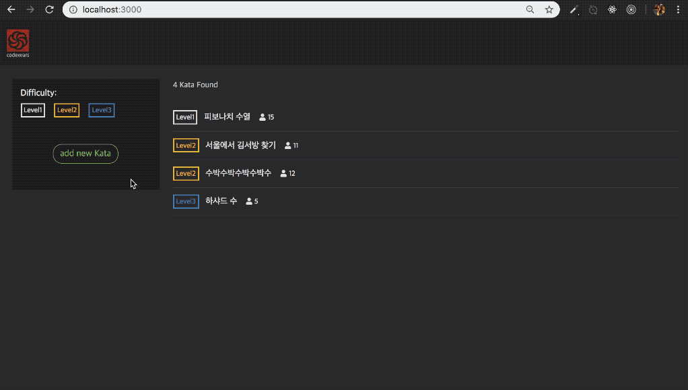

# Vanilla codewars

알고리즘 문제를 풀고, 직접 문제를 등록할 수 있는 어플리케이션입니다.



## Setup

Install dependencies

```sh
$ yarn install (or npm install)
```
  
## Development

```sh
npm run dev
```

## Skills 
- Node.js
- Express
- MongoDB
- mongoose

## Features

- 좌측 상단의 아이콘을 클릭하면 첫 페이지로 이동합니다.
- Level 1, 2, 3에 해당하는 탭을 클릭했을 때, 해당 레벨에 속하는 문제들만 필터링해서 보여줍니다.
- 리스트의 각 문제들을 눌렀을 때, 문제 화면으로 이동합니다.
- 문제 화면에서 해당 문제에 대한 솔루션을 입력하고 'Attempt' 버튼을 클릭하면 채점결과를 볼 수 있습니다.
- 태스트를 통과하지 못한 경우, 어떤 테스트가 통과하지 못했는지에 대한 내용을 볼 수 있습니다.
- 제출된 코드 실행 도중 문제가 발생한 경우, 발생한 문제에 대한 메시지가 보여집니다.
- 첫 페이지에서 'add new Kata' 버튼을 클릭하면, 사용자가 직접 문제를 등록할 수 있는 페이지로 이동합니다.

## Reference

* [NodeJS](https://nodejs.org/api/)
* [Express](https://expressjs.com/)
* [Mongoose](http://mongoosejs.com/)
